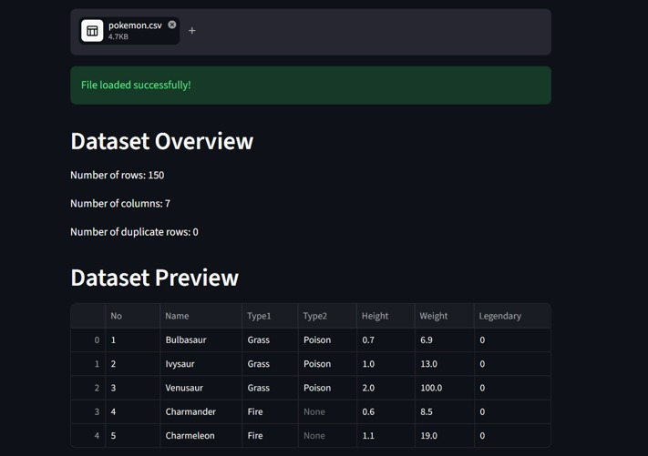
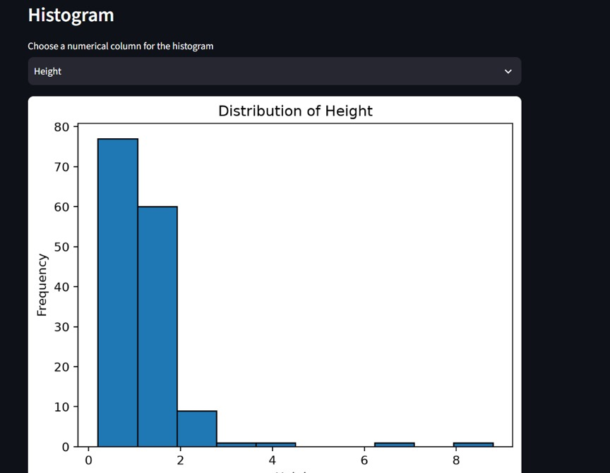
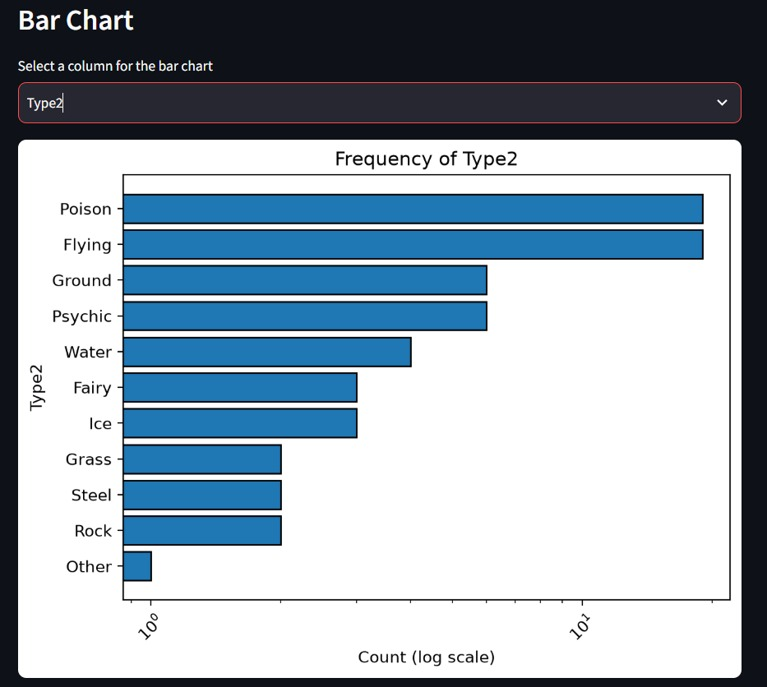
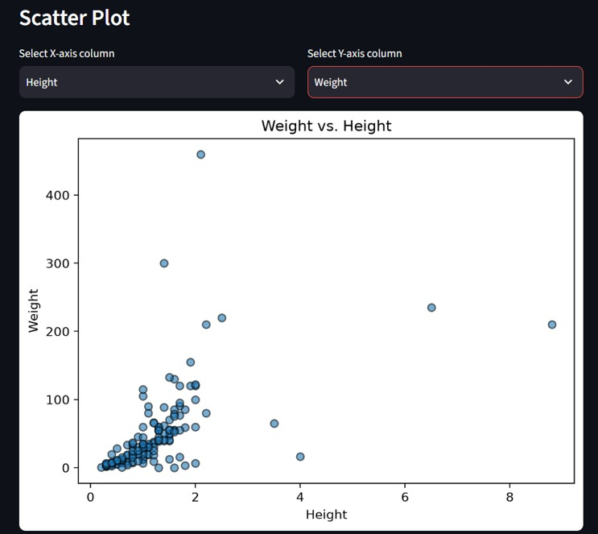
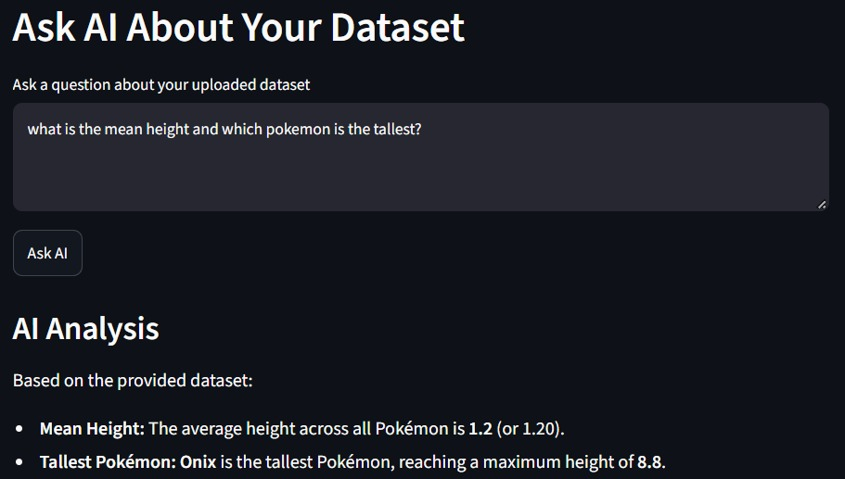

# AI Data Analyst Assistant

An AI-powered data analysis application built with **Python, Streamlit, Pandas, and Google Gemini**. Upload a dataset, explore its structure, generate visualizations, and ask natural-language questions about your data.

---

## Overview

The AI Data Analyst Assistant is an interactive web application designed to simplify exploratory data analysis (EDA).

It allows users to upload CSV, Excel, and JSON files, inspect dataset statistics, identify data-quality issues, visualize data, and use an AI assistant to interpret dataset information.

The application also includes a chart-aware context feature that provides relevant statistical information to the AI when a user asks a question about a chart.

## Features

### Dataset Upload and Exploration
- Upload CSV, Excel, and JSON datasets.
- Preview uploaded data.
- View dataset dimensions and column data types.

### Data Analysis
- Missing-value summary.
- Duplicate-row count.
- Numerical descriptive statistics.
- Correlation matrix displayed as a table.
- Potential outlier detection using the Interquartile Range (IQR) method.

### Data Visualization
- **Histogram:** Explore the distribution of numerical variables.
- **Bar Chart:** Visualize category frequencies, displaying the top 10 categories and grouping the remaining categories as "Other" when applicable.
- **Scatter Plot:** Explore relationships between two numerical variables.

### AI-Powered Dataset Q&A
- Ask natural-language questions about uploaded datasets.
- Use Google Gemini to generate AI-assisted explanations.
- Add computed dataset results to prompts for supported questions.
- Include chart-related statistical context when chart-related questions are detected.

## Technology Stack

| Technology | Purpose |
|---|---|
| Python | Core programming language |
| Streamlit | Interactive web application |
| Pandas | Data processing and analysis |
| Matplotlib | Data visualization |
| Google Gemini API | AI-powered question answering |
| Git and GitHub | Version control and source-code hosting |

## Project Structure

```text
AI-Data-Analyst-Assistant/
├── assets/
│   └── screenshots/
├── data/
│   └── sample.csv
├── src/
│   ├── __init__.py
│   ├── ai_assistant.py
│   ├── analysis.py
│   ├── data_loader.py
│   ├── prompt_builder.py
│   └── visualization.py
├── .gitignore
├── app.py
├── README.md
└── requirements.txt
```

## Getting Started

### Prerequisites

- Python installed on your system.
- Git (optional, for cloning the repository).
- A Google Gemini API key for AI-powered question answering.

### 1. Clone the repository

```bash
git clone https://github.com/manav-raghav/AI-Data-Analyst-Assistant.git
cd AI-Data-Analyst-Assistant
```

### 2. Create a virtual environment

**Windows:**

```bash
python -m venv .venv
.venv\Scripts\activate
```

### 3. Install dependencies

```bash
pip install -r requirements.txt
```

### 4. Configure your Gemini API key

Create a file named `.env` in the project root directory.

Add your API key using the environment variable name expected by `src/ai_assistant.py`.

Example, if the code expects `GEMINI_API_KEY`:

```env
GEMINI_API_KEY=your_api_key_here
```

**Important:** Never upload your API key or the `.env` file to GitHub.

### 5. Run the application

```bash
streamlit run app.py
```

Streamlit will provide a local URL where you can open the application in your browser.

## Screenshots

Add screenshots of the actual application to `assets/screenshots/`.

### Dataset Preview



### Histogram



### Bar Chart



### Scatter Plot



### AI Dataset Analysis



Replace these images with screenshots of the working application. If a screenshot is not available yet, remove its image reference until you add it.

## How It Works

1. The user uploads a dataset.
2. The application loads the file into a Pandas DataFrame.
3. Dataset summaries and data-quality information are generated.
4. Users select columns to create visualizations.
5. Users submit natural-language questions through the AI interface.
6. The application prepares dataset context and, for supported questions, computes results directly from the data.
7. Chart-related questions receive additional chart-specific context.
8. The AI generates a response using the provided context.

## Limitations

- AI-generated responses may contain inaccuracies and should be verified.
- Chart-aware context contains structured information rather than the actual rendered chart image.
- Chart-question detection is keyword-based and may not recognize every phrasing.
- Potential outliers are statistical flags and are not automatically removed.
- Correlation does not imply causation.
- The local Ollama fallback was explored but may not work reliably in every environment.

## Future Improvements

- Add more visualization types, including box plots and line charts.
- Add a correlation heatmap.
- Improve chart-question detection and chart-context generation.
- Improve data-cleaning capabilities.
- Add automated testing and improve error handling.
- Optimize processing for larger datasets.
- Improve deployment and configuration documentation.

## Repository

GitHub: [AI Data Analyst Assistant](https://github.com/manav-raghav/AI-Data-Analyst-Assistant)

## Author

**Manav Raghav**  
B.Tech. Computer Science and Engineering  
Amity University Haryana

## License

No license has been specified for this project yet.
